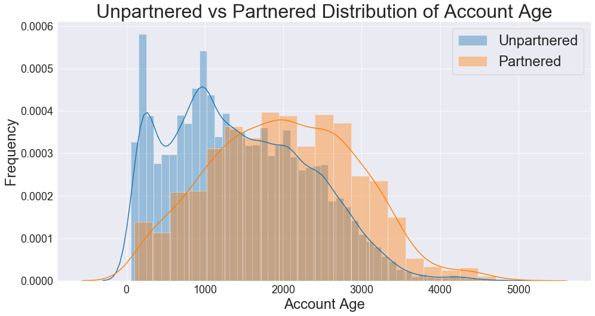
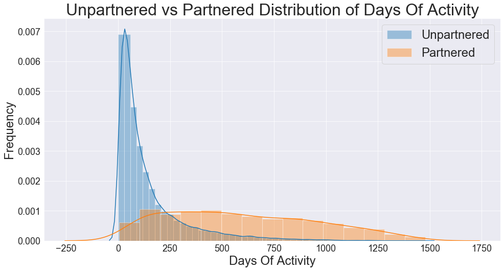
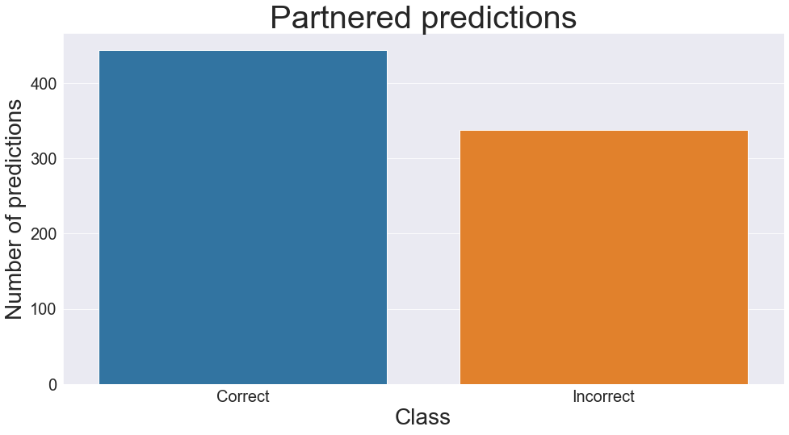

# Streamer Analysis

**Author**: Griffin Hundley
***


## Repository Structure

```
├── README.md                           <- The top-level summary of project
├── PDF                                 <- PDF versions of readme, final notebook, and presentations
├── notebooks                           <- Narrative documentation of analysis in Jupyter notebook
│   └── final-notebook.ipynb            <- Final notebook
├── models                              <- .h5 files that contain the iterations of the modeling process
├── src                                 <- directory containing source code
│   ├── __init__.py                     <- .py file that signals to python these folders contain packages
│   ├── modeling.py                     <- .py code used in the modeling process
│   └── scraping.py                     <- .py code used to obtain data from Twitch API and other sources
├── data                                <- Sourced from Twitch API and Twitchtracker
└── images                              <- Sourced externally and generated from code
```

## Overview

Twitch is a social platform for livestreaming video games, music, art, and more. For most people making content on the platform, livestreaming started out as a hobby for people sharing their love of gaming - something they do only because its fun. For a select few who build a strong community and gain a larger audience, they can turn their channel into a primary source of income by becoming a partner with Twitch.

Being a partner has a lot of perks, but also a few restrictions. Partners get a subscription button added to their channel, where viewers can pay $5 for 1 month access to subscriber-only emotes, don't have to watch advertisements, and receive channel specific rewards. Partners also get a share of the revenue for ads ran on their channel. As part of the contract that partners sign, they cannot livestream on other platforms.

As of February 2020, there are 3.8 million unique broadcasters on the website, with an average of 56,000 concurrent broadcasters, and 1.44 million concurrent viewers at a given time. Of those 3.8 million broadcasters, there are roughly 41,000 partners.

Source: Mansoor Iqbal https://www.businessofapps.com/data/twitch-statistics/

***

## Business Problem


Source: Mansoor Iqbal https://www.businessofapps.com/data/twitch-statistics/

Livestreaming is emerging as a premiere online industry, with significant growth over the years. As of December 2020, the effects of COVID are still being realized, however there are reports of 24-50% increase in Twitch viewership as a result of the pandemic lockdowns (T. Wilde).

Online entertainment isn't going anywhere. As a result of increasing scale, more online companies must rely on automated systems. For example - Twitch competitors Youtube Live and Facebook Gaming use automated systems to detect copywrite infringment and obscene content. As the number of broadcasters and viewers continues to rise, and as the entertainment industry shifts more online, the number of people turning to livestreaming as a source of income increases.

Applications for partnership are currently reviewed manually by Twitch staff, with applicants waiting 2-4 weeks to get results (Twitch FAQ). Because partnership is approved manually by different individuals, there can be a personal selective bias towards or against certain demographics. In some cases, very successful streamers with well above average metrics have been denied partnership, while much smaller channels are approved, leading to distrust between the broadcaster and Twitch.

The goal of this analysis is to provide a model that can approve or deny channels for partnership based on their channel metrics, removing the need for manual review, which frees up resources, decreases feedback time to streamers on the status of their partnership application, and having a system without personal bias. Additionally, the nature of the model allows for dynamically adjusting the threshold for approval, to make it more or less strict depending on the needs of Twitch.

Source: Thomas Wilde https://www.geekwire.com/2020/twitch-sets-audience-record-october-pandemic-continues-fuel-livestreaming-growth/

***

## Data

Over the course of a week, at different times during the day, the Twitch API was queried through all of the pages of currently live broadcasters to generate a list of ~800,000 broadcasters. These broadcasters were then filtered to only channels older than 60 days, with over 900 viewers (~300,000 broadcasters). This is to filter out brand new channels, and only to examine channels that meet the basic number of viewers to be considered for partnership as described in the Path to Partnership achievement. From the twitch api, the data being collected covers:

view_count: total number of lifetime channel views

account_age: time since account creation

broadcaster_type: (partner, affiliate, unaffiliated)

From these ~300K broadcasters, a random sample of 10% of those channels (~30k) was chosen to obtain a reasonably sized dataset. For these ~30k channels, data was webscraped from twitchtracker.com. The channel metrics being examined are lifetime aggregate channel data. The specific metrics gathered are:

hours_streamed: total number of hours stream has been live

average_viewers: average number of concurrent viewers

peak_viewers: peak number of concurrent viewers

days_of_activity: total number of days where stream was live

total_games_streamed: total number of games streamed

daily_broadcast_time: average hours channel is live per day

hours_watched_daily: average number of hours watched by viewers per day

followers_per_stream: average number of followers gained per stream

views_per_stream: average number of concurrent viewers per stream

followers_per_hour: average number of followers per hour

views_per_hour: average number of views per hour

hours_watched: total hours watched by viewers

active_days_per_week: average of how many days per week the broadcast is live

average_games: average number of games played per stream

### Data Assumptions

A key assumption being made with this analysis is that a channel's total lifetime aggregate metrics can be used to classify a channel by partnership. Not having access to the date when a channel is partnered, analysis can only be made on the metrics as they currently are, not when the channel was partnered. As a result, theoretically this biased analysis should produce a harsher classifier, with the idea that once a channel is partnered it will continue to grow and inflate its metrics, and by association inflate the decision boundary. If a model produced from this analysis were to be used by Twitch in its partnership approval process, in deployment, Twitch would have access to those specific metrics and would not have this bias.

Another assumption this analysis makes is that the distribution of streamers who were recently-live over the late fall data collection period is representitive of all streamers as a whole. As only streamers who were recently live over the data collection period were included in the analysis, only ~5% of the total number of partners were counted. As such, any seasonality that exists among streamers, for example - summertime streamers that have access to a larger audience of individuals on summer break - would not be captured.

Features not used in this analysis that Twitch currently uses in their partner selection is chat interaction - how active are the viewers in the chat room. This information would theoretically be important to classifying small streams, as a small stream with a very active chat could be partners.

Additionally, Twitch makes a distinction between 'natural' views and views gained through hosts and raids (when one channel sends all of its viewers to another channel), and only natural views count towards their decision. This analysis has no method of identifying natural views from views gained through hosts or raids, and will assume that views are natural. The theoretical effect of this assumption is a slight deflation of importance in view-related features.

Finally, the unpartnered class is assumed to be vying for partnership. Twitch records of which channels have been previously denied for partnership, along with the dates and frequency of their denial, are not accessible. These would be important features to include in a final implementation of the resulting model, as a distinction could be made between streamers who are just casually streaming, and those seriously considering partnership.
***

## Exploratory Data Analysis





***

## Methods

To begin the modeling process, the training data is loaded in and split into a 80% training set and a 20% validation set.  The data is normalized with StandardScaler to reduce the distance between points, allowing for clusters within the data to be spotted more easily, and to reduce exploding/vanishing weights causing the model to diverge.  Model architecture will be fit on the training data, using validation data to diagnose the bias-variance relationship.  In each iteration, the metrics and level of overfitting will be examined.  In subsequent iterations, dropout will be used as the primary regularization method in order to achieve a generalizable model. The method of compiling will use adaptive moment estimation with a learning rate of 0.00001 for the optimization function, and because this is a binary classification, the loss function will be binary crossentropy.  The model is fit with minibatches of size 32, over 100 epochs.

### Model Selection 

Once the performance of the models plateau, the best performing model will be used to predict on the holdout data set. The scores being examined will be f1, accuracy, recall, and precision. The final selected model will be one that achieves a high precision for a specific threshold of the sigmoid output. Precision is the key metric, with the goal of minimizing false positives. In this situation, due to the automated nature of this partnership approval model, it should be stricter than it is lenient in regards to classifying a channel as a partner. We do not want the model to incorrectly assign channels partnership, because partnership is usually permanent, while denied applications can be resubmitted after a month.

## Results


In the figures above, this model performs the best of all the iterations. The reduction in complexity, as well as the dropout regularization, has the model consistently perform better on the validation set than on the training set indicating high generalizability. Additionally, the extreme amounts of fluctuations over epochs seems to have been smoothed out considerably.


Visualizing how the model performs at selecting the negative class, it apparently performs very well. Out of 16,611 truly unpartnered channels, the model correctly classifies 16,573 of them, and incorrectly classifies 38.



From this confusion matrix, out of 16,611 truly non-partnered channels, only 38 were falsely classified as being partner, indicating a specificity of 0.998. Regarding the true partner class, of 781, 444 were correctly classified as partner, giving a recall/sensitivity of 0.57. This corresponds with the initial assumption that the nature of the model would be more selective due to the inherent bias in the data.

***

## Conclusions

This model performs very well at being selective with a specificity of 0.998 and a precision of .92. Although it suffers a bit with a 57% hit rate on partnered channels, because denied applications can reapply at a later point, it's not a permanent decision, where in the reverse case, giving a stream partnership is usually permanent. When a channel is denied, they have an unlimited number of attempts, giving them time to build their channel and reapply later with a better chance of success.

One serious flaw however, is this model fails to account for chat participation and interaction, and does not assess individual character/behavior to identify if a streamer is a brand risk or poor representitive of the company. A widely popular streamer who constantly brings negative attention to the platform, for example, might not be a wise choice to partner. To address this concern, this model could be used in conjunction with another classifier model that specifically looks at chat interaction, with the purpose of detecting negativity and brand risk with natural language processing.

Twitch currently approves ~5k partners per year. With the number of streamers doubling every few years, and with previously denied applicants constantly resubmitting applications, the number of applications will continue to increase, causing the current method of manual selection to need adjustment. Given this, I recommend this model be used as a transitionary adjunct to the current system to increase it's capacity and reduce feedback delay.

In this case, the model will generate probabilities for channels, with a threshold below which channels are denied, and channels above which are reviewed by hand, taking into account the chat interaction and identify if they are a good representitive of the company. This would reduce the amount of applications needed to be looked at manually, and the assigned probability can assist the staffperson in their review.

With the models 99.8% specificity, this model will correctly discriminate the vast majority of unpartnered channels. As these will be the majority of applications, the model succeeds in its goal to reduce the amount of manual review. For the channels where the probability is high, manual review will still be necessary.

In this transitionary period, the effects of the model could be field tested. Feedback from this field test would be implemented into a full switch from manual review to a fully machine based application process that considering channel metrics, chat interaction, brand risk, etc. This addresses the scalability of the application process, and will potentially reduce or eliminate personal bias introduced by multiple individual staff members being involved in the process.

***

## Next Steps

Moving forward I would like to address the assumptions made with the data. With access to Twitch's data that excludes artifical views, and can target historical data at the time of partnership, the model would likely be much more accurate at predicting the partner class without losing it's selectivity against unpartnered channels.

Additionally, expanding the amount of data collection is a logical next step. In this analysis only 5% of the total partners were included in the dataset. A more representitive model would be a random subset of the entire partner population.

Twitch currently uses chat activity as an important metric when deciding partnership. Getting data on chat participation, and chat activity, in addition to identifying negativity and sentiment would address the flaws in the current model.

***

## Contact Information

Griffin Hundley

Email: hundlegq@dukes.jmu.edu

Github: github.com/griffinhundley

Linkedin: linkedin.com/in/griffin-hundley-61b020118/

***
